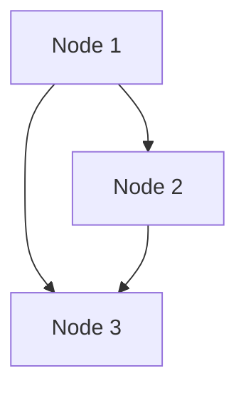
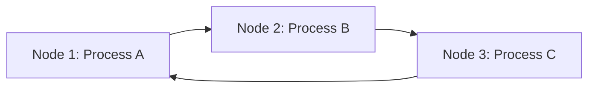
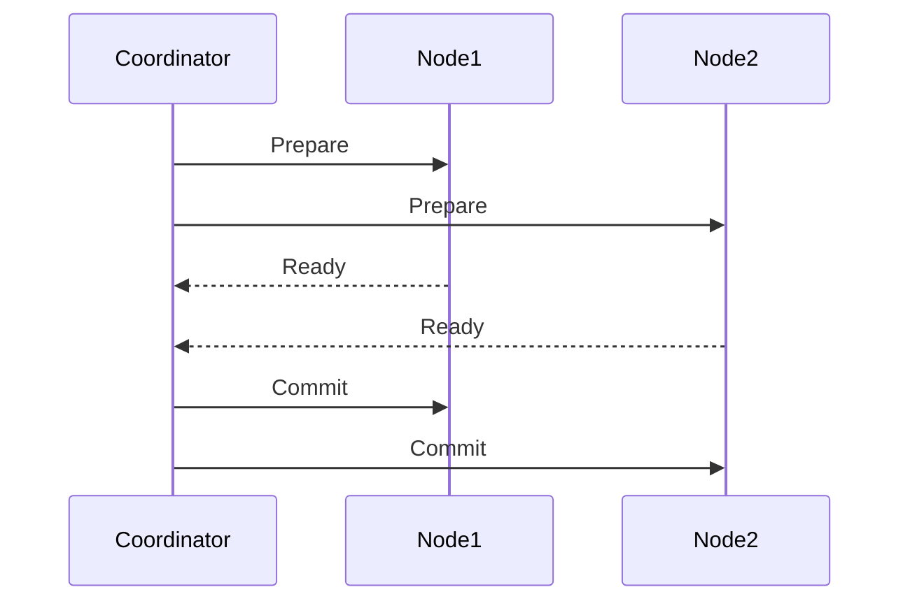
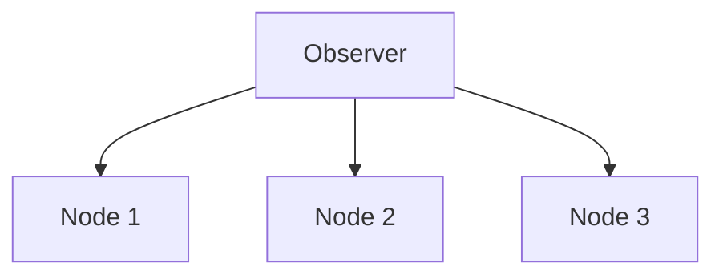
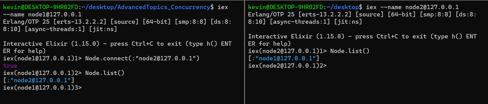
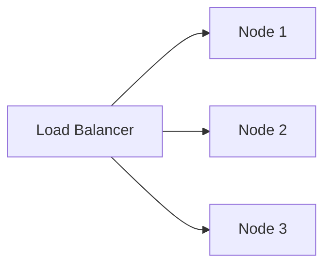
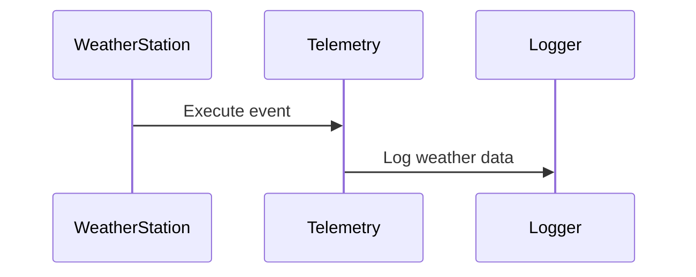
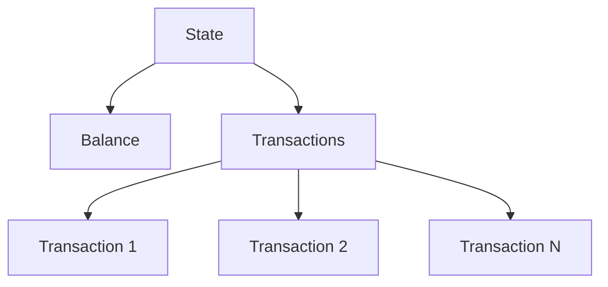
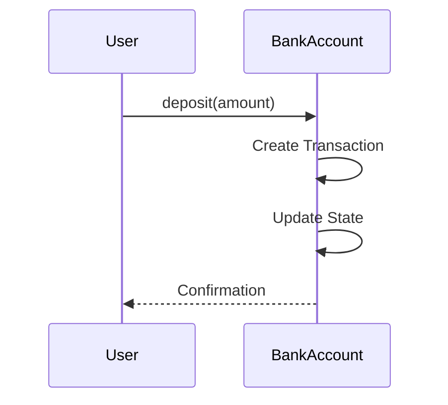
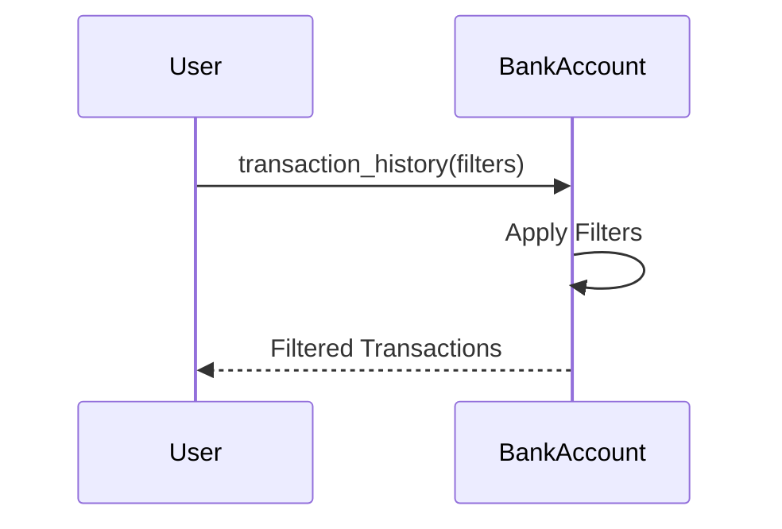

# AdvancedTopics_Concurrency

## Lesson: More Concurrency, Supervision, and Registry in Elixir

### Part 1: Supervisors
# Lesson: More Concurrency, Supervision, and Registry in Elixir

## Part 1: Supervisors

### Introduction to Supervisors

Supervisors are specialized processes that monitor other processes (called child processes). If a child process crashes, the supervisor will restart it, thus providing resilience to your system.

Exercise 1: Implementing a Supervisor for BankAccount

1. Create a Supervisor Module: Define a supervisor that will manage BankAccount processes.

```
defmodule BankSupervisor do
  use Supervisor

  def start_link(_) do
    Supervisor.start_link(__MODULE__, :ok, name: :bank_supervisor)
  end

  def init(:ok) do
    children = [
      {BankAccount, 1000} # Example child specification
    ]
    Supervisor.init(children, strategy: :one_for_one)
  end
end
```
Modify the BankAccount Module: Ensure that the BankAccount module is suitable for supervision.

Exercise 1A: Implement the BankSupervisor.

Step 1: Modify the BankAccount Module
Before we can supervise the BankAccount, we need to make sure it's suitable for supervision. 
Ensure that the BankAccount module's start_link function is set up correctly. Here's a general outline:
```
defmodule BankAccount do
  use GenServer

  def start_link(initial_balance) do
    GenServer.start_link(__MODULE__, initial_balance, name: :bank_account)
  end

  # ... rest of the code ...
end
```

Step 2: Implement the BankSupervisor

Create a new module named BankSupervisor to manage the BankAccount processes. This supervisor will restart the child process if it crashes.
```
defmodule BankSupervisor do
  use Supervisor

  def start_link(_) do
    Supervisor.start_link(__MODULE__, :ok, name: :bank_supervisor)
  end

  def init(:ok) do
    children = [
      {BankAccount, 1000} # Example child specification
    ]
    Supervisor.init(children, strategy: :one_for_one)
  end
end
```

Step 3: Start the Supervisor and BankAccount

- Exercise 1A: Implement the BankSupervisor module as described above.

- Exercise 1B: Start the BankSupervisor and then start a BankAccount under its supervision. 
You can do this in an IEx session or within your application's start function:
```
{:ok, _} = BankSupervisor.start_link([])
BankAccount.start_link(1000) # Starts a bank account with an initial balance of 1000
```

# Part 2: Registry
## Introduction to Registry

The Registry module in Elixir allows processes to be registered under a unique key. This is particularly useful for identifying processes, such as bank accounts, by their account numbers.

Exercise 2: Implementing Registry for BankAccount

1. Create a Registry Module: Define a registry for bank accounts.

```
defmodule BankRegistry do
  use Registry

  def start_link do
    Registry.start_link(keys: :unique, name: BankRegistry)
  end
end
```

Modify BankAccount for Registration: Update the BankAccount start_link function to register with the account number.
```
def start_link(account_number, initial_balance) do
  GenServer.start_link(__MODULE__, initial_balance, name: {:via, Registry, {BankRegistry, account_number}})
end
```

Example: Starting two accounts with different numbers.
```
BankAccount.start_link("ACC123", 1000)
BankAccount.start_link("ACC456", 500)
```

Exercise 2A: Modify the BankAccount application to use Registry.

Step 1: Create a Registry Module
First, create a new module named BankRegistry that will act as the registry for bank accounts.
```
defmodule BankRegistry do
  use Registry

  def start_link do
    Registry.start_link(keys: :unique, name: BankRegistry)
  end
end
```

This module uses Elixir's built-in Registry module, specifying that keys (in our case, account numbers) must be unique.

Step 2: Modify the BankAccount Module
Next, update the BankAccount module's start_link function to register each new bank account with a unique account number in the BankRegistry.
```
defmodule BankAccount do
  # ... existing code ...

  def start_link(account_number, initial_balance) do
    GenServer.start_link(__MODULE__, initial_balance, name: {:via, Registry, {BankRegistry, account_number}})
  end

  # ... rest of the code ...
end
```

Step 3: Start the Registry and Test the BankAccount
- Exercise 2A: Modify the BankAccount application to use Registry as described above. You'll also need to ensure that the BankRegistry is started when your application starts.
- Exercise 2B: Test by creating accounts with unique numbers and perform some transactions. Here's a sample sequence you can try in an IEx session:
```
{:ok, _} = BankRegistry.start_link()
{:ok, _} = BankAccount.start_link("ACC123", 1000)
{:ok, _} = BankAccount.start_link("ACC456", 500)
BankAccount.deposit("ACC123", 200)
BankAccount.withdraw("ACC456", 100)
```

# Part 3: Multiple Accounts and Transfers
## Supporting Multiple Accounts

With the Registry in place, as implemented in the previous exercise, you can now create multiple accounts with unique account numbers. 
This allows the system to differentiate between various customer accounts and operate on them individually.

### Implementing Transfers
A common banking operation is transferring money from one account to another. This operation must be atomic, meaning that it either completes entirely or not at all. 
If any error occurs during a transfer, such as insufficient funds, the entire operation should be rolled back.

Add a Transfer Function: Implement a function in BankAccount to perform transfers.
```
def transfer(from_account, to_account, amount) do
  # Implementation here
end
```

- Exercise 3A: Write a Function to Perform a Transfer Between Two Accounts

Sample skeleton implementation:

```
def transfer(from_account, to_account, amount) do
  with {:ok, _} <- withdraw(from_account, amount),
       {:ok, _} <- deposit(to_account, amount) do
    {:ok, "Transfer successful"}
  else
    error -> error
  end
end
```

- Exercise 3B: Handle Possible Errors Such as Insufficient Funds
The above implementation is a good start, but it lacks proper error handling. If the withdrawal from the from_account fails due to insufficient funds, the entire operation should be rolled back.

Handle Insufficient Funds: If the withdrawal from the from_account fails, you must not proceed with the deposit into the to_account.

Provide Informative Errors: Return descriptive error messages that indicate what went wrong, such as {:error, "Insufficient funds"}.

Here's an enhanced version of the transfer function:
```
def transfer(from_account, to_account, amount) do
  from_account_pid = Registry.lookup(BankRegistry, from_account) |> List.first()
  to_account_pid = Registry.lookup(BankRegistry, to_account) |> List.first()

  case BankAccount.withdraw(from_account_pid, amount) do
    {:ok, _} ->
      case BankAccount.deposit(to_account_pid, amount) do
        {:ok, _} -> {:ok, "Transfer successful"}
        error -> error
      end
    {:error, reason} -> {:error, reason}
  end
end
```

This version checks the result of the withdrawal and only proceeds with the deposit if the withdrawal was successful. If there's an error, it returns that error immediately.

Exercise Questions:
- How does a Supervisor restart a process? What happens if the Supervisor itself crashes?
- Describe the purpose of the Registry module in Elixir. How can it be used in managing processes?
- Discuss the advantages and disadvantages of using a global Registry vs. a local Registry in an Elixir application.

# Part 4: Concurrency and Error Handling

## Handling Concurrent Operations

Concurrency enables multiple operations to occur simultaneously. In a bank system, this means handling simultaneous deposits, withdrawals, and transfers.

Error Handling
Proper error handling ensures that your application behaves correctly under various scenarios.
Add Guard Clauses: Include guard clauses to validate inputs.


- Exercise 4B: Add error handling for scenarios like insufficient funds.


**Extra Reading:**

[Elixir Supervisors](https://elixir-lang.org/getting-started/mix-otp/supervisor-and-application.html)

[Elixir Registry](https://hexdocs.pm/elixir/Registry.html)

# Part 5: Distributed Systems in Elixir

## Table of Contents

1. **Introduction to Distributed Systems**
2. **Understanding Nodes and Remote Connections**
   - Example 5.1: Connecting Nodes Manually
3. **Distributed Registry and Process Management**
   - 5.2.1 Implementing a Distributed Registry
   - 5.2.2 Creating and Managing Processes Across Nodes
4. **Distributed Transactions and Atomic Operations**
   - Example 5.3: Perform a Transfer Between Accounts on Different Nodes
5. **Monitoring and Managing Distributed Systems**
   - 5.4.1 Telemetry
6. **TSBank - New Feature: Transaction History Feature in BankAccount**
   - Step 1: Define a Transaction Structure
   - Step 2: Update the BankAccount State
   - Step 3: Record Transactions
   - Step 4: Implement Transaction History Retrieval
   - Step 5: Formatting and Displaying Transactions
   - Step 6: Testing
   - Step 7: Enhancements
   - Understanding the State
   - Conclusion

### Exercises

#### Distributed Systems
- Exercise 5.1: Explore Node Disconnection
- Exercise 5.2: Handle Network Partitions
- Exercise 5.3: Visualize System Information
- Exercise 5.2: Explore Distributed Registry
- Exercise 5.3: Remote Process Management
- Exercise 5.4: Implement Two-Phase Commit
- Exercise 5.5: Implement Distributed System Monitoring


#### Transaction History Feature in BankAccount

#### To Be done in Parallel with the coursework this week

- Exercise 5A: Modify the withdraw and transfer functions to record transactions.
- Exercise 5B: Implement the handle_call for transaction history retrieval and write a private function to apply filters.
- Exercise 5C: Write a function to format the transaction history. Look at the library Tabula.ex for inspiration.
- Exercise 5D: Write ExUnit tests to verify the transaction history feature.
- Exercise 5E: Implement one or more enhancements as described above.


## Introduction to Distributed Systems

Distributed systems enable parallel computation, enhance fault tolerance, and facilitate resource sharing by connecting multiple individual machines, known as nodes. These nodes work together to achieve common tasks and provide a cohesive system, improving performance, scalability, and resilience. Elixir, leveraging the capabilities of the Erlang virtual machine (BEAM), offers intrinsic support for distributed computing. This section explores foundational concepts and practical aspects of distributed systems, providing hands-on examples and exercises to deepen understanding.

### We will cover the following areas:

1. **Nodes and Remote Connections**: Understanding how to create and manage nodes in Elixir, enabling communication and collaboration within the distributed system.
2. **Distributed Registry and Process Management**: Techniques to register and manage processes across different nodes, facilitating cross-node communication and coordination.
3. **Distributed Transactions and Atomic Operations**: Implementing distributed transactions to ensure consistency and atomicity across multiple nodes, including two-phase commit protocols.
4. **Monitoring and Managing Distributed Systems**: Tools and strategies to monitor and manage distributed systems, including Telemetry and the Observer tool.

#### Nodes and Remote Connections
In distributed systems, nodes are individual instances of the Erlang virtual machine that can run independently or be connected to form a cluster. Communication between nodes happens through message passing, a unifying approach to concurrency and distribution.



#### Distributed Registry and Process Management
Processes can be registered and accessed globally within a connected cluster of nodes. This functionality allows for building features that require cross-node communication and coordination.



#### Distributed Transactions and Atomic Operations
Distributed transactions ensure that operations across multiple nodes are carried out atomically. All parts of the transaction either succeed together or fail together, maintaining consistency.



#### Monitoring and Managing Distributed Systems
Effective monitoring and management of distributed systems are vital for understanding system behavior, performance, and reliability. Tools like Telemetry and the Observer provide valuable insights.




### 5.1 Understanding Nodes and Remote Connections

Nodes in Elixir are individual instances of the Erlang virtual machine. They can run isolated or be connected to form a distributed system. Communication between nodes happens through message passing, unifying the approach to concurrency and distribution.

#### Example 5.1: Connecting Nodes Manually

##### Step 1: Start Two Nodes

```bash
# Terminal 1
iex --name node1@127.0.0.1

# Terminal 2
iex --name node2@127.0.0.1
```

Starting two nodes with unique names allows them to communicate and identify each other.


##### Step 2: Connect Nodes - Use 2 different terminals here

```bash
# In Terminal 1
Node.connect(:"node2@127.0.0.1")
# Verify with
Node.list() # on both terminals
```
This step establishes the connection between the two nodes, allowing them to send messages to each other.

##### Step 3: Send Messages Between Nodes

```bash
# On node1
Node.spawn(:"node2@127.0.0.1", fn -> IO.puts("Hello from node2"); Process.sleep(10000) end)
```
This code snippet spawns a process on node2 but displays the output on node1, showing the ease of remote execution. Although the process runs on node2, the output is displayed on node1. Elixir displays messages from remote nodes in the format `{:node, message}`. In this case, the message is `Hello from node2`. The `Process.sleep/1` function is used to keep the process alive for 10 seconds. This allows us to inspect the process on node2. 

```bash
# On node2
Process.list()
```
This command lists all processes running on node2. You should see the process spawned from node1.

##### Step 4: Inspect the Remote Process

```elixir
# On node2
Process.info(#PID<XXXX.XXX.XXX>)
```
Inspecting a remote process provides insights into its current state, such as memory usage and status.

##### Step 5: Disconnect Nodes

On either node
```elixir
Node.disconnect(:"node2@127.0.0.1")
```
Disconnecting nodes can help in simulating network failures and understanding how the system behaves under such conditions. 

#### Exercise 5.1: Explore Node Disconnection

- **Description**: Experiment with disconnecting the nodes you created earlier. See how your system responds and try to reconnect them.
- **Hint**: Use `Node.disconnect/1` and `Node.connect/1`.
- **Sample Task**: Disconnect nodes, then reconnect and verify the connection using `Node.list()`.

#### Exercise 5.2: Handle Network Partitions

- **Description**: Simulate network partitions and reconnecting nodes. Observe how message passing is affected.
- **Hint**: Utilize `:net_kernel.disconnect/1` and `:net_kernel.connect/1`.
- **Sample Task**: Create a network partition, send messages between nodes, and observe the behavior.

#### Exercise 5.3: Visualize System Information

- **Description**: Use the Observer tool to visualize system and process information.
- **Hint**: Run `:observer.start/0` to start the Observer tool.
- **Sample Task**: Start the Observer and explore different tabs like "Load Charts," "Applications," and "Processes."

#### Further Exploration:

1. **Running Functions on Different Nodes**: Execute various functions on different nodes to understand remote execution.
2. **Disconnecting and Reconnecting Nodes**: Experiment with disconnecting and reconnecting nodes to simulate network issues.
3. **Monitoring Processes Across Nodes**: Use `Process.monitor/1` to monitor processes across nodes.
4. **Observer Tool**: Utilize the `:observer.start/0` tool for a graphical view of the system.
5. **Exploring Process Information**: Use functions like `Process.list/0` to explore processes on a node.
6. **Handling Errors Across Nodes**: Explore mechanisms to handle errors and failures in a distributed system.

##### Note:

Nodes can be on the same machine or distributed across different machines, providing a flexible architecture for scalable applications. Understanding nodes and remote connections is foundational for building distributed systems in Elixir.

This example and exercises provide a hands-on introduction to distributed computing in Elixir. By exploring these concepts, you'll be well-equipped to develop scalable and fault-tolerant applications.


### 5.2 Distributed Registry and Process Management

Distributed systems often require global process management to enable communication and collaboration across different nodes. In Elixir, the `:global` module facilitates this by providing a way to register processes across nodes.

#### 5.2.1 Implementing a Distributed Registry

##### Explanation:

Elixir's `:global` registry allows processes to be registered and accessed globally within a connected cluster of nodes. This is essential for building features that require cross-node communication and coordination.

##### Example 5.2.1: Modify BankRegistry to Use `:global`

###### Step 1: Modify the Existing BankRegistry

```elixir
defmodule BankRegistry do
  use Registry
  
  def start_link do
    :global.register_name(BankRegistry, self())
    Registry.start_link(keys: :unique, name: __MODULE__)
  end
end
```

###### Step 2: Start the Modified BankRegistry on Both Nodes

```
# On both nodes
BankRegistry.start_link()
```

###### Step 3: Verify Cross-Node Registration
```

# On either node
:global.registered_names()
```

Note:
This code snippet demonstrates how to register a process across all connected nodes, allowing true distributed computation.

#### Exercise 5.2: Explore Distributed Registry
Description: Experiment with the :global module by creating, registering, and accessing processes across different nodes.
Hint: Utilize :global.register_name/2 and :global.whereis_name/1.
Sample Task: Register a process globally and then access it from another node.

- [MORE INFO](https://erlang.org/doc/man/global.html)


##### 5.2.2 Creating and Managing Processes Across Nodes
Explanation:
Creating and managing processes across nodes is a fundamental aspect of distributed systems. Elixir provides tools to spawn, monitor, and manage remote processes, enabling fault tolerance and load balancing.

#### Example 5.2.2: Create a Process on Another Node
Step 1: Start a Process on Node1
- Start a named process on Node1 that performs a specific task. Here's an example of starting a process that prints a message repeatedly:

```elixir
# On Node1
pid = spawn(fn -> 
  :timer.sleep(1000)
  IO.puts("Hello from Node1")
end)
```

Step 2: Monitor the Process from Node2
- On Node2, you can monitor the process created on Node1. This allows Node2 to receive notifications if the process on Node1 terminates.
```elixir
# On node2
Process.monitor(pid)
```

Step 3: Observe Behaviors
Experiment with killing and restarting the process to understand fault tolerance and load balancing. You can kill the process on Node1 using:

```elixir
# On Node1
Process.exit(pid, :kill)
```
And observe on Node2 that a message is received, indicating that the process has terminated.

```elixir
# On Node2
receive do
  {:DOWN, _ref, :process, _pid, reason} -> IO.puts("Process terminated because of #{reason}")
end
```

Fault Tolerance: Monitoring processes across nodes allows the system to detect failures and take corrective actions, such as restarting the process on another node.

Load Balancing: By spawning processes on different nodes, you can distribute the workload evenly, preventing any single node from becoming a bottleneck.

Process Communication: Processes on different nodes can communicate through message passing, just like local processes. This unifies the way you write concurrent and distributed code in Elixir.

Observing Distributed Systems: Tools like :observer.start can be used to visually inspect the state of distributed systems, including process connections across nodes.

#### Exercise 5.2

Build a Distributed Counter: Design a counter that can be incremented and read from different nodes. Use distributed processes to achieve synchronization.

#### Further Reading:
[Distributed Elixir Guide](https://elixir-lang.org/getting-started/mix-otp/distributed-tasks-and-configuration.html)

Erlang :rpc Module Documentation
This enhanced section provides a clearer understanding of how to create and manage processes across nodes in Elixir, along with practical examples and insights into related concepts. It also includes exercises and further reading to deepen understanding.


#### Exercise 5.3: Remote Process Management
Description: Create and manage processes on remote nodes, observing behaviors like fault tolerance and load balancing.
Hint: Use Node.spawn/2 and Process.monitor/1.
Sample Task: Spawn a process on a remote node, monitor it, and then intentionally kill it to observe recovery behavior.

[More Info](https://elixir-lang.org/getting-started/io-and-the-file-system.html#distributed-elixir)


#### Further Reading and Self-Study:

1. **Global Name Registration**: Experiment with registering names globally using `:global`. This allows processes to be accessed by a unique name across all connected nodes.
    - [Erlang Global Module Documentation](https://erlang.org/doc/man/global.html)
    
2. **Remote Process Monitoring**: Learn to monitor and manage remote processes. This is essential for observing the state and behavior of processes running on other nodes.
    - [Erlang Process Module Documentation](https://erlang.org/doc/man/erlang.html#process_info-2)
    
3. **Distributed Task Execution**: Explore running tasks across a cluster of nodes, allowing for parallel execution and improved efficiency.
    - [Elixir Task Module Documentation](https://hexdocs.pm/elixir/Task.html)
    
4. **Load Balancing**: Implement load balancing by distributing tasks across nodes. This ensures that no single node is overwhelmed, leading to better performance.
    - [Horde: A Distributed Supervisor Library](https://github.com/derekkraan/horde)




Tools and Libraries: Explore tools like :rpc for remote procedure calls and libraries like Horde for distributed computing.
[:rpc Module Documentation](https://erlang.org/doc/man/rpc.html)
[Horde: A Distributed Supervisor Library](https://github.com/derekkraan/horde)


### 5.3 Distributed Transactions and Atomic Operations

#### Explanation:

Distributed transactions ensure that operations across multiple nodes are carried out atomically. This means that all parts of the transaction either succeed together or fail together, maintaining consistency across the system. Elixir provides mechanisms like two-phase commit to manage distributed transactions.

#### Example 5.3: Perform a Transfer Between Accounts on Different Nodes

##### Step 1: Start Accounts on Different Nodes

-   Register accounts with unique identifiers on different nodes.
-   Verify registration using `:global.whereis_name/1`.

##### Step 2: Implement a Transfer Function

```elixir
def transfer(from_account, to_account, amount) do
  from_pid = :global.whereis_name({BankRegistry, from_account})
  to_pid = :global.whereis_name({BankRegistry, to_account})
  # Perform transaction logic here, ensuring atomicity
end 
```

##### Step 3: Perform a Transfer and Verify the Transaction
- Invoke the transfer function with appropriate parameters.
- Verify that the transfer was successful, and the system state is consistent.


#### Exercise 5.4: Implement Two-Phase Commit
Description: Implement a two-phase commit protocol to ensure atomicity in distributed transactions. This involves a coordinator that controls the commit process across all participating nodes.
Hint: Use GenStateMachine or :gen_statem to handle transaction states. Understand the "Prepare" and "Commit" phases of the protocol.

#### Two-Phase Commit Protocol on Wikipedia
Sample Task: Design and implement a two-phase commit process for transferring funds between accounts on different nodes.

[(Two-Phase Commit)](https://en.wikipedia.org/wiki/Two-phase_commit_protocol)


### 5.4 Monitoring and Managing Distributed Systems

Monitoring and managing distributed systems is essential for maintaining system health, performance, and reliability. In this section, we will create a weather station application in Elixir and use Telemetry to monitor temperature and humidity.

#### 5.4.1 Telemetry

Telemetry is a powerful library for performance observability. It allows you to attach custom behavior to various events in your application.

##### Example 5.4: Using Telemetry to Monitor Weather Station Metrics

###### Step 1: Create a New Elixir Project

```bash
mix new weather_station
cd weather_station
```

###### Step 2: Add Telemetry Library to Your Project

- Open mix.exs and add Telemetry to the dependencies:

```elixir
defp deps do
  [
    {:telemetry, "~> 0.4"}
  ]
end
```

Then run:
```elixir
mix.deps.get
```

###### Step 3: Create a Weather Station Module
- Create a module that simulates collecting weather data and publishes telemetry events.

```elixir
defmodule WeatherStation do
  def collect_data do
    temperature = Enum.random(15..35)
    humidity = Enum.random(30..70)

    :telemetry.execute([:weather, :data], %{temperature: temperature, humidity: humidity}, %{})
  end
end
```

###### Step 4: Attach Telemetry Handlers
- Create handlers to react to the telemetry events.

```elixir
defmodule WeatherStation.TelemetryHandler do
  require Logger

  def handle_event([:weather, :data], measurements, _metadata, _config) do
    Logger.info("Collected weather data: Temperature #{measurements.temperature}°C, Humidity #{measurements.humidity}%")
  end
end

:telemetry.attach("weather-data-handler", [:weather, :data], &WeatherStation.TelemetryHandler.handle_event/4, %{})
```

###### Step 5: Monitor Weather Data

- You can now call WeatherStation.collect_data() to simulate data collection. Telemetry will log the temperature and humidity.



##### Exercise 5.5: Implement System Monitoring
- Description: Experiment with Telemetry by adding more metrics to the Weather Station, such as wind speed or pressure.
- Hint: Define additional metrics and handlers, and experiment with various data visualization tools that integrate with Telemetry.

[Telemmetry Docs](https://hexdocs.pm/telemetry/readme.html#installation)

##### Further Reading and Self-Study:

1. **Telemetry**: Explore the Telemetry library and its capabilities. This is a powerful tool for monitoring and managing distributed systems.
    - [Telemetry Documentation](https://hexdocs.pm/telemetry/readme.html#installation)

2. **Observer**: Use the Observer tool to visualize system metrics and behavior. This is a powerful tool for understanding system performance.

    - [Observer Documentation](https://hexdocs.pm/observer/observer.html)

3. **Monitoring and Managing Distributed Systems**: Explore tools and techniques for monitoring and managing distributed systems. This is essential for maintaining system health and performance.

    - [Elixir Monitoring and Managing Distributed Systems](https://elixir-lang.org/getting-started/mix-otp/distributed-tasks-and-configuration.html#monitoring-and-managing-distributed-systems)

4. **Distributed Systems**: Learn more about distributed systems and how they work. This is essential for understanding the concepts and techniques covered in this section.

    - [Distributed Systems](https://en.wikipedia.org/wiki/Distributed_computing)

5. **Fault Tolerance**: Explore fault tolerance and how it can be achieved in distributed systems. This is essential for building resilient systems.

    - [Fault Tolerance](https://en.wikipedia.org/wiki/Fault_tolerance)

6. **Load Balancing**: Learn about load balancing and how it can be implemented in distributed systems. This is essential for building scalable systems.

    - [Load Balancing](https://en.wikipedia.org/wiki/Load_balancing_(computing))


----------------------------------------------------------------------------
# TSBank - New Feature

## Transaction History Feature in BankAccount

## Introduction

We'll extend the BankAccount application to include a transaction history feature. This will allow users to view a history of their deposits, withdrawals, and transfers, similar to a bank statement.

### Step 1: Define a Transaction Structure

Define a structure to represent a transaction. Each transaction will have a type, amount, date, and description.
```elixir
defmodule Transaction do
  defstruct type: nil, amount: 0, date: nil, description: nil
end
```

### Step 2: Update the BankAccount State

Modify the state in the BankAccount module to include a list of transactions.

#### Initialize the State
```elixir
def init(initial_balance) do
  {:ok, %{balance: initial_balance, transactions: []}}
end
```

### Step 3: Record Transactions

Update the deposit, withdraw, and transfer functions to record transactions.

#### Example: Deposit
```elixir
def handle_cast({:deposit, amount}, %{balance: balance, transactions: transactions} = state) do
  new_balance = balance + amount
  transaction = %Transaction{type: :deposit, amount: amount, date: DateTime.utc_now(), description: "Deposit"}
  {:noreply, %{state | balance: new_balance, transactions: [transaction | transactions]}}
end
```

### Exercise 5A: Modify the withdraw and transfer functions to record transactions similarly.

### Step 4: Implement Transaction History Retrieval

Add a function to retrieve the transaction history, with optional filters.

```elixir
def transaction_history(account_number, filters \\\\ %{}) do
  GenServer.call({:via, Registry, {BankRegistry, account_number}}, {:transaction_history, filters})
end
```

### Exercise 5B: Implement the \`handle_call\` for transaction history retrieval and write a private function to apply filters.

### Step 5: Formatting and Displaying Transactions

Create a function to format the transaction history as a table or JSON.

### Exercise 5C: Write a function to format the transaction history. Look at the library Tabula.ex for inspiration.

### Step 6: Testing

Write tests for the new features.

### Exercise 5D: Write ExUnit tests to verify the transaction history feature.

### Step 7: Enhancements (Optional)

Consider implementing additional enhancements like pagination, sorting, or security controls.

### Exercise 5E: Implement one or more enhancements as described above.

## Understanding the State

State in a GenServer is a critical concept that represents the current condition of the process. It can be of any data type. In our BankAccount example, the state is a map containing the balance and a list of transactions.

### State Diagram


#### Initialize the State with Logging
```elixir
def init(initial_balance) do
  Logger.info("Initializing bank account with balance: #{initial_balance}")
  {:ok, %{balance: initial_balance, transactions: []}}
end
```

### Recording Transactions

When a deposit, withdrawal, or transfer occurs, we record a transaction. We'll update the state to include the new transaction.

### State Transition Diagram for Deposit


#### Example: Deposit with Logging
```elixir
def handle_cast({:deposit, amount}, %{balance: balance, transactions: transactions} = state) do
  new_balance = balance + amount
  Logger.info("Depositing #{amount}. New balance: #{new_balance}")

  transaction = %Transaction{type: :deposit, amount: amount, date: DateTime.utc_now(), description: "Deposit"}
  Logger.debug("Recording transaction: #{inspect(transaction)}")

  {:noreply, %{state | balance: new_balance, transactions: [transaction | transactions]}}
end
```

### Transaction History Retrieval

When retrieving the transaction history, we can include optional filters, such as a date range or specific transaction types.

### Sequence Diagram for Transaction History Retrieval


## Conclusion

The transaction history feature provides insight into the financial activities within the BankAccount application. It demonstrates key concepts such as struct definition, state management, filtering, and formatting.

## Follow-up Questions

1.  How would you design a feature to allow users to export their transaction history as a CSV file?
2.  How could you modify the application to support different currencies and exchange rates?
3.  Discuss potential security concerns related to transaction history and propose solutions.
4.  Explain the importance of atomic operations in the context of recording transactions.
5.  How would you implement real-time notifications for transactions (e.g., using Phoenix Channels)?)
