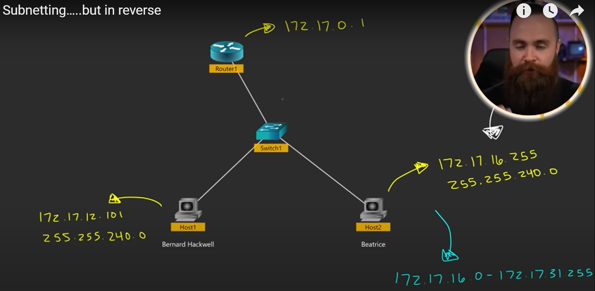

## What is an IP Address?

Internet Protocol - Opens up communication and allows for devices to connect to the internet.

 * Can be found on windows using `ipconfig`
 	* Can find IP address, Subnet Mask & Default Gateway

 * Router uses DHCP to give devices IP Addresses.
 * `192.168.1.xxx` - Why do they start with those digits
 	*  The subnet mask is responsibile for this
        * Subnet Musk - `255.255.255.0`
	* Each group of 3 digits are called an octat
 	* The 255 represents locked-in unchangeable numbers (network portion) the 0 represents an arbitrary number allocated between 0 - 255 (host portion)
 	* The network portion stays the same because the devices nearby are on the same network.
	* If IP address you are trying to connect to outside its network, it has to talk to its default gateway.
	* Three IP addresses are reserved - The network address: `192.168.1.0` & the broadcast address: `192.168.1.255` & the default gateway: `192.169.1.1`

## Are we out of IP Addressing :anguished:

There are 232 IP addresses available.
The are 5 classes of IP addresses.

| | Range                       | Subnet Mask   |
|--- | --------------------------  | ------------- |
|A| 1.0.0.0 - 126.255.255.2555  | 255.0.0.0     |
|B| 128.0.0.0 - 191.255.0.0     | 255.255.0.0   |
|C| 192.0.0.0 - 223.255.255.0   | 255.255.255.0 | 
|D| 224.0.0.0 - 239.255.255.255 |               |
|E| 240.0.0.0 - 255.255.255.255 |               |

### Classes:

 `Class A` -> Host heavy networks -> 224  
 `Class B` -> 216  
 `Class C` -> Largest IP range: 28  
 `Class D` -> Multicast  

Between `Class A` & `Class B` is 127.0.0.0 --> These are reserved on you computer for testing. The 127 triggers **loopback**

## Private IP Addresses and NAT:

`RFC 1918` - Private IP addresses. You need a public IP Address to interact with the internet. 

| | Range                       | Subnet Mask   |
|--- | --------------------------  | ------------- |
|A| 10.0.0.0 - 10.255.255.255 | 255.0.0.0     |
|B| 172.16.0.0 - 172.31.255.255 | 255.255.0.0   |
|C| 192.168.0.0 - 192.168.255.255 | 255.255.255.0 |

Private IP are not routable on the internet. So... 
### NAT -> Network Address Translation

	* Router performs NAT
	* Translates private IP into public IP via Router
	* It allocates 1 IP Address by ISP -> Internet Service Provider
	* When request is sent back, it is routed back to that specific device
	* This soultion did not last because we still ran out of IP Addresses.

### Thus intoduction to IPv6 -> 2128

## Your IP Address in the Matrix

* IP is referred in octats
* This means each 255 -> is a representation of an 8-bit number.
* An example of an IP Address using binary is: `11000000.10101000.00000001.00010101` 
* This represents **4 Bytes**.

## Subnet masking:

**192.168.32.5**

**1100 0000.1010 1000.0010 000.0000 0101**

`Network bits` - Tells us which network we are on. Cannot change.
`Host bit` - Can be assigned to a host.

`255.255.255.0`
`255.255.254.0`

## Subnetting your home:

Example IP: `192.168.1.0/24`  

**Subnet mask** -> `255.255.255.0`  
1111 1111. 1111 1111. 1111 1111. 0000 0000

Lets create 4 networks: We need to change 2 bits...  
1111 1111. 1111 1111. 1111 1111. 1100 0000

Steps to create subnet mask:
1. Use the Nosferatz chart to calculate how many host bits you need to hack.
2. Hack the host bits.
3. Find the increment.
4. Create your networks

### The 4 (subnets) networks:
	* 192.168.1.0 - 192.168.1.63
	* 192.168.1.64 - 192.168.1.127
	* 192.168.1.128 - 192.168.1.191
	* 192.168.1.192 - 192.168.1.255

How many hosts are available?

Since we looking at the sixth bit... 26 = 64
thus, 64 available hosts.

## Subnetting in reverse:

	* type -> ipconfig / ifconfig
	* IP Address..................: 172.17.16.255
	* Subnet Mask.................: 255.255.240.0
	* Default Gateway.............: 172.17.0.1

`255.255.240.0`   
`1111 1111. 1111 1111. 111 000. 000 000` 

Let get our increment: 
* It is the last bit in our subnet mask:
	* |128|64|32|16|8|4|2|
	* | 1 |1 |1 |1 |0|0|0|
	* Thus the last is 16. 

* 172.17.0.0 - 172.17.15.255
* 172.17.16.0 - 172.17.31.255
* 172.17.32.0 - ...
* 172.17.64.0 - ...
* ....

The router is situated at 172.17.0.1  
Beatrice is at 172.17.16.255 which is in the range of: 172.17.16.0- 172.17.31.255  
Thus, Beatrice is not able to get access to the internet.  
